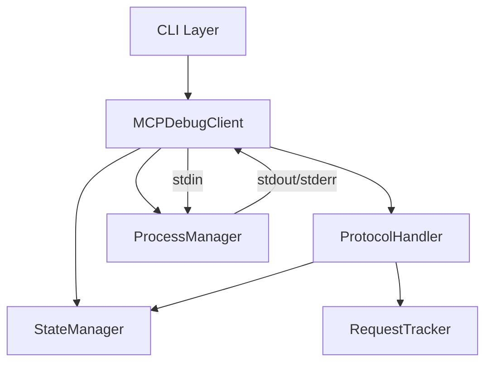
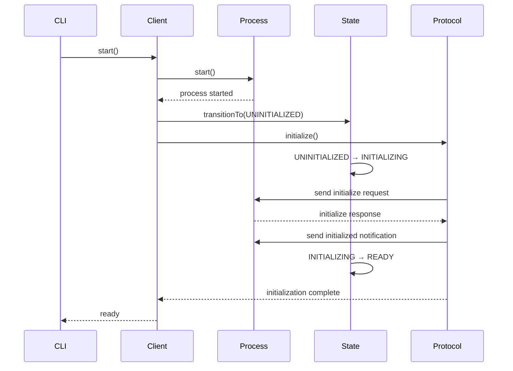
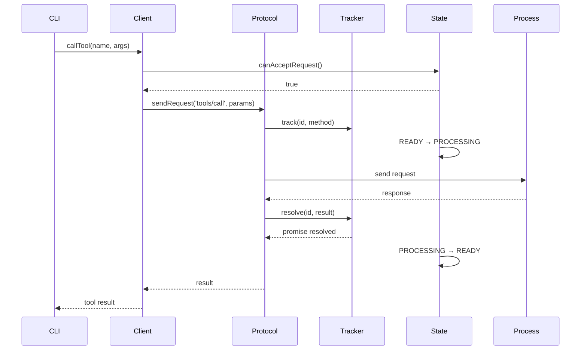

# mcp-debug アーキテクチャ設計

## 概要

mcp-debugは、MCPプロトコルに準拠したデバッグツールとして、明確な責務分離と状態管理を中心に設計されています。

## アーキテクチャ概要



## コンポーネント設計

### 1. StateManager（状態管理）

**責務**: MCPサーバーのライフサイクル状態を管理

```typescript
enum MCPServerState {
  UNINITIALIZED,  // 初期状態
  INITIALIZING,   // 初期化中
  READY,          // リクエスト受付可能
  PROCESSING,     // 処理中
  SHUTTING_DOWN,  // シャットダウン中
  TERMINATED      // 終了
}
```

**主要機能**:
- 状態遷移の妥当性検証
- 状態変更通知
- 非同期状態待機

**設計原則**:
- 不正な状態遷移を防ぐ
- イベント駆動型の状態管理
- タイムアウト付き待機

### 2. RequestTracker（リクエスト追跡）

**責務**: JSON-RPC IDによるリクエスト/レスポンスの相関管理

```typescript
interface PendingRequest {
  method: string;
  params?: any;
  resolve: (value: any) => void;
  reject: (error: any) => void;
  timeout: NodeJS.Timeout;
  timestamp: Date;
}
```

**主要機能**:
- ID生成と管理
- タイムアウト処理
- リクエスト/レスポンス対応付け

**設計原則**:
- ユニークID保証
- メモリリーク防止
- 並行リクエスト対応

### 3. MCPProtocolHandler（プロトコル処理）

**責務**: MCPプロトコルメッセージの処理

```typescript
interface MCPMessage {
  jsonrpc: "2.0";
  id?: string | number;
  method?: string;
  params?: any;
  result?: any;
  error?: MCPError;
}
```

**主要機能**:
- initialize/initialized シーケンス
- リクエスト送信
- レスポンス/通知処理

**設計原則**:
- プロトコル仕様準拠
- 状態管理との協調
- エラーハンドリング

### 4. ProcessManager（プロセス管理）

**責務**: 子プロセスのライフサイクル管理

```typescript
interface ProcessManagerOptions {
  serverPath: string;
  args?: string[];
  env?: NodeJS.ProcessEnv;
  timeout?: number;
}
```

**主要機能**:
- プロセス起動/停止
- stdio通信
- イベント通知

**設計原則**:
- リソース管理
- 優雅な終了
- エラー伝播

### 5. MCPDebugClient（統合クライアント）

**責務**: すべてのコンポーネントを統合

```typescript
class MCPDebugClient {
  private stateManager: MCPStateManager;
  private processManager: ProcessManager;
  private protocolHandler: MCPProtocolHandler;
  private requestTracker: RequestTracker;
}
```

**主要機能**:
- コンポーネント調整
- 公開API提供
- メッセージルーティング

## データフロー

### 1. 初期化フロー



### 2. ツール実行フロー



## エラーハンドリング

### エラー伝播階層

```
ProcessManager Error
    ↓
MCPDebugClient Error Handler
    ↓
StateManager (→ TERMINATED)
    ↓
RequestTracker (reject all pending)
    ↓
CLI Error Display
```

### エラー種別と対応

| エラー種別 | 発生箇所 | 対応 |
|-----------|---------|------|
| プロセス起動失敗 | ProcessManager | 即座に終了 |
| 初期化タイムアウト | ProtocolHandler | 状態をTERMINATEDへ |
| リクエストタイムアウト | RequestTracker | Promiseをreject |
| 不正な状態遷移 | StateManager | エラーをthrow |
| JSONパースエラー | Client | ログ出力して継続 |

## 並行性と同期

### 並行処理対応

- **複数リクエスト**: RequestTrackerがIDで管理
- **非同期イベント**: EventEmitterパターン
- **状態待機**: Promise + タイムアウト

### 同期ポイント

1. **初期化完了待機**
   ```typescript
   await stateManager.waitForState(MCPServerState.READY);
   ```

2. **リクエスト完了待機**
   ```typescript
   const result = await requestTracker.track(id, method);
   ```

## メモリ管理

### リソースクリーンアップ

```typescript
cleanup(): void {
  // タイマークリア
  this.pendingRequests.forEach(req => clearTimeout(req.timeout));
  
  // イベントリスナー削除
  this.removeAllListeners();
  
  // プロセス終了
  this.childProcess?.kill();
  
  // 状態リセット
  this.state = MCPServerState.TERMINATED;
}
```

### メモリリーク防止策

- タイムアウト後の自動クリーンアップ
- イベントリスナーの適切な削除
- 循環参照の回避
- WeakMapの活用（将来的な改善）

## 拡張性

### プラグインアーキテクチャ（将来構想）

```typescript
interface MCPDebugPlugin {
  name: string;
  onStateChange?(oldState: MCPServerState, newState: MCPServerState): void;
  onRequest?(message: MCPMessage): void;
  onResponse?(message: MCPMessage): void;
}
```

### カスタムハンドラー

```typescript
// カスタムプロトコル拡張
protocolHandler.registerMethod('custom/method', async (params) => {
  // カスタム処理
  return result;
});
```

## パフォーマンス考慮事項

### 最適化ポイント

1. **メッセージバッファリング**
   - 改行まで蓄積してからパース
   - 大量メッセージの効率的処理

2. **非同期I/O**
   - ノンブロッキング処理
   - ストリーム処理

3. **タイムアウト管理**
   - 適切なデフォルト値
   - 設定可能なタイムアウト

## セキュリティ考慮事項

### 入力検証

- JSON-RPCメッセージの検証
- パラメータのサニタイゼーション
- 子プロセス引数のエスケープ

### プロセス分離

- 子プロセスでのサーバー実行
- 権限の最小化
- リソース制限

## テスタビリティ

### ユニットテスト可能な設計

```typescript
// モック可能なインターフェース
interface IProcessManager {
  start(): Promise<void>;
  stop(): Promise<void>;
  sendInput(data: string): void;
}

// DIによるテスト
const client = new MCPDebugClient({
  processManager: mockProcessManager,
  // ...
});
```

### 統合テストサポート

- Echo Serverによるエンドツーエンドテスト
- 状態遷移の検証
- タイムアウトシナリオのテスト