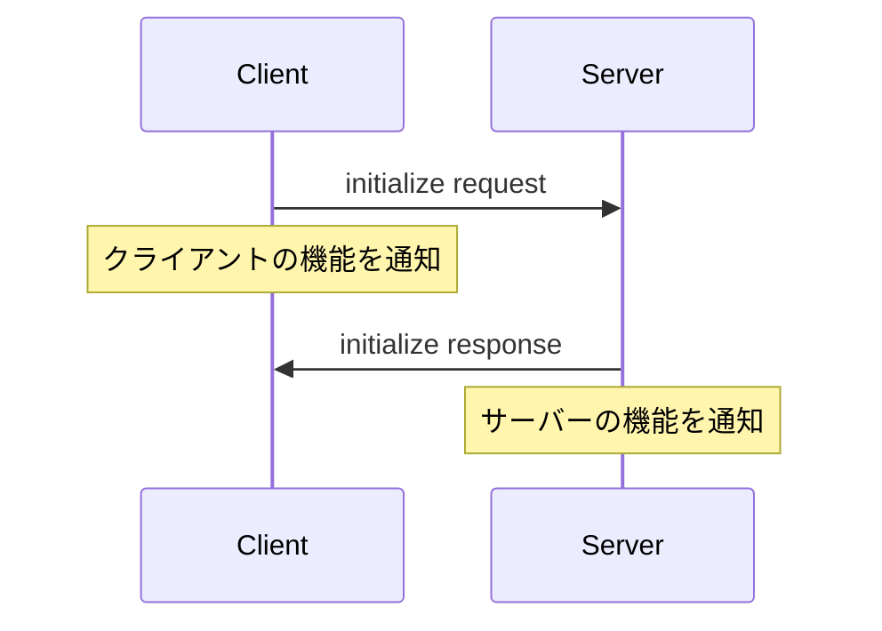

# MCP Protocol Best Practices Guide

MCPプロトコルの基本概念、よくある誤解、ベストプラクティスをまとめたガイドです。

## 目次

1. [初期化プロトコルの正しい理解](#初期化プロトコルの正しい理解)
2. [Capabilitiesとは何か](#capabilitiesとは何か)
3. [ツールリストの取得方法](#ツールリストの取得方法)
4. [通知(Notifications)の処理](#通知notificationsの処理)
5. [よくある誤解と解決方法](#よくある誤解と解決方法)

---

## 初期化プロトコルの正しい理解

MCPの初期化は2段階のプロセスです。

### フェーズ1: Initialize Request/Response



**クライアント → サーバー (initialize request):**

```json
{
  "jsonrpc": "2.0",
  "id": 1,
  "method": "initialize",
  "params": {
    "protocolVersion": "2024-11-05",
    "capabilities": {
      "tools": {}
    },
    "clientInfo": {
      "name": "mcp-debug",
      "version": "1.0.0"
    }
  }
}
```

**サーバー → クライアント (initialize response):**

```json
{
  "jsonrpc": "2.0",
  "id": 1,
  "result": {
    "protocolVersion": "2024-11-05",
    "capabilities": {
      "tools": {
        "listChanged": true
      }
    },
    "serverInfo": {
      "name": "coeiro-operator",
      "version": "1.0.0"
    }
  }
}
```

### フェーズ2: Initialized Notification

**クライアント → サーバー (initialized notification):**

```json
{
  "jsonrpc": "2.0",
  "method": "notifications/initialized",
  "params": {}
}
```

この通知により、サーバーは「クライアントが初期化完了を認識した」ことを知り、READY状態に遷移します。

---

## Capabilitiesとは何か

### 重要な概念

**Capabilities ≠ ツールリスト**

`capabilities` は「サーバーが持つ機能の宣言」であり、実際のツールリストではありません。

### Capabilitiesの構造

```typescript
interface ServerCapabilities {
  tools?: {
    listChanged?: boolean;  // ツールリストが動的に変更される機能をサポート
  };
  prompts?: {
    listChanged?: boolean;
  };
  resources?: {
    subscribe?: boolean;    // リソースの購読機能をサポート
    listChanged?: boolean;
  };
  logging?: {};             // ロギング機能をサポート
}
```

### 各フィールドの意味

| フィールド | 意味 |
|-----------|------|
| `tools.listChanged` | サーバーが実行時にツールリストを変更する可能性があり、変更時に `notifications/tools/list_changed` 通知を送信する |
| `prompts.listChanged` | プロンプトリストが動的に変更される |
| `resources.subscribe` | リソースの変更を購読できる |
| `logging` | ロギング機能をサポート |

---

## ツールリストの取得方法

### 正しい方法: tools/list リクエスト

実際のツールリストを取得するには、`tools/list` メソッドを呼び出す必要があります。

```json
{
  "jsonrpc": "2.0",
  "id": 2,
  "method": "tools/list",
  "params": {}
}
```

**レスポンス:**

```json
{
  "jsonrpc": "2.0",
  "id": 2,
  "result": {
    "tools": [
      {
        "name": "operator_status",
        "description": "現在のオペレータ状態を取得",
        "inputSchema": {
          "type": "object",
          "properties": {}
        }
      },
      {
        "name": "operator_available",
        "description": "利用可能なオペレータ一覧を取得",
        "inputSchema": {
          "type": "object",
          "properties": {}
        }
      }
    ]
  }
}
```

### 実装例

```typescript
// ❌ 間違った方法
const capabilities = client.getServerCapabilities();
const tools = capabilities.tools; // これは機能宣言であり、ツールリストではない

// ✅ 正しい方法
const response = await client.sendRequest('tools/list', {});
const tools = response.tools; // 実際のツールリスト
```

---

## 通知(Notifications)の処理

### notifications/tools/list_changed

サーバーのツールリストが動的に変更された場合、サーバーはこの通知を送信します。

**サーバー → クライアント:**

```json
{
  "jsonrpc": "2.0",
  "method": "notifications/tools/list_changed"
}
```

### クライアント側の処理

```typescript
// 通知ハンドラーの設定
protocolHandler.setNotificationHandler((method, params) => {
  if (method === 'notifications/tools/list_changed') {
    // ツールリストを再取得
    const updatedTools = await client.sendRequest('tools/list', {});
    console.log('Tools updated:', updatedTools);
  }
});
```

### その他の通知

| 通知メソッド | 意味 |
|------------|------|
| `notifications/tools/list_changed` | ツールリストが変更された |
| `notifications/prompts/list_changed` | プロンプトリストが変更された |
| `notifications/resources/list_changed` | リソースリストが変更された |
| `notifications/resources/updated` | 特定のリソースが更新された |
| `notifications/progress` | 長時間処理の進捗通知 |
| `notifications/message` | サーバーからのメッセージ |

---

## よくある誤解と解決方法

### 誤解1: capabilitiesがツールリストである

**症状:**
```typescript
const capabilities = client.getServerCapabilities();
console.log(capabilities.tools);
// 出力: { listChanged: true }
// 期待: ツールの配列
```

**原因:**
`capabilities.tools` は「ツールリストが動的に変更される」という機能宣言であり、ツールリストそのものではありません。

**解決方法:**
```typescript
// tools/list リクエストを送信
const response = await client.sendRequest('tools/list', {});
const tools = response.tools; // 実際のツールリスト
```

### 誤解2: initialize レスポンスにツールリストが含まれる

**症状:**
```typescript
const initResponse = await protocolHandler.initialize(capabilities);
// initResponse にツールリストが含まれると期待
```

**原因:**
MCPプロトコルでは、初期化レスポンスには機能宣言のみが含まれます。実際のツールリストは別途取得する必要があります。

**解決方法:**
```typescript
// 1. 初期化
await protocolHandler.initialize(capabilities);

// 2. ツールリストを取得
const toolsList = await protocolHandler.listTools();
```

### 誤解3: listChangedがツール名である

**症状:**
```typescript
const tools = ['listChanged']; // これはツール名ではない
```

**原因:**
`listChanged` はツール名ではなく、capability（機能宣言）のフィールド名です。

**解決方法:**
capability を正しく理解し、`tools/list` で実際のツールリストを取得してください。

---

## 完全な初期化フロー

```typescript
// 1. MCPサーバーのプロセスを起動
await processManager.start();

// 2. サーバーがUNINITIALIZED状態になるまで待機
await stateManager.waitForState(MCPServerState.UNINITIALIZED);

// 3. initialize リクエストを送信
const initResponse = await protocolHandler.initialize({
  tools: {},
});

// 4. サーバーの capabilities を保存
const serverCapabilities = initResponse.capabilities;
console.log('Server capabilities:', serverCapabilities);
// 出力例: { tools: { listChanged: true } }

// 5. READY状態になるまで待機
await stateManager.waitForState(MCPServerState.READY);

// 6. 実際のツールリストを取得
const toolsListResponse = await protocolHandler.listTools();
console.log('Available tools:', toolsListResponse.tools);
// 出力例: [
//   { name: 'operator_status', description: '...' },
//   { name: 'operator_available', description: '...' }
// ]

// 7. listChanged がサポートされている場合、通知ハンドラーを設定
if (serverCapabilities.tools?.listChanged) {
  protocolHandler.setNotificationHandler((method, params) => {
    if (method === 'notifications/tools/list_changed') {
      // ツールリストを再取得
      handleToolsListChanged();
    }
  });
}
```

---

## チェックリスト

MCPクライアント実装時の確認事項：

- [ ] `initialize` リクエストを送信し、サーバーの capabilities を取得
- [ ] `capabilities` を機能宣言として正しく理解（ツールリストではない）
- [ ] `notifications/initialized` を送信してサーバーをREADY状態に遷移
- [ ] `tools/list` リクエストで実際のツールリストを取得
- [ ] `notifications/tools/list_changed` 通知のハンドラーを実装
- [ ] ツールリスト変更時に `tools/list` を再取得

---

## 参考資料

- [MCP Protocol Specification](./mcp-protocol-specification.md)
- [Library API Documentation](./library-api.md)
- [E2E Testing Guide](./e2e-testing.md)
