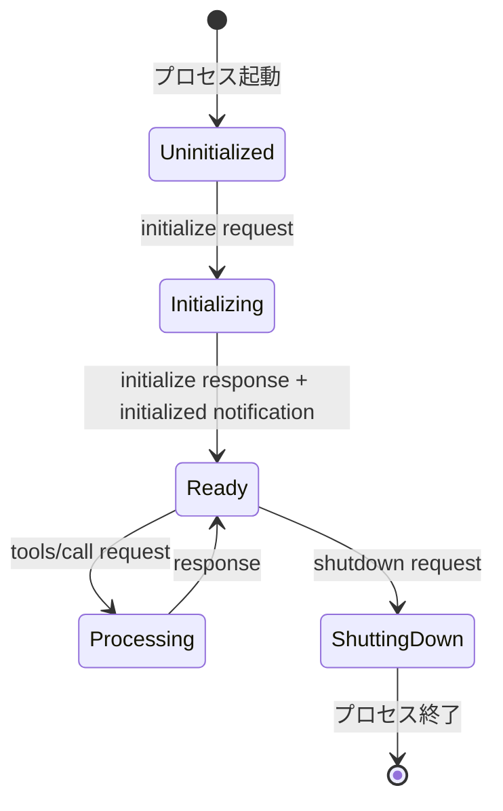

# MCP (Model Context Protocol) 仕様

## 概要

MCP (Model Context Protocol) は、AIモデルとツール間の標準化された通信プロトコルです。JSON-RPCベースで、stdio（標準入出力）を通じた通信を行います。

## プロトコル仕様

### 1. トランスポート層

MCPはstdioトランスポートを使用：
- **標準入力**: クライアント → サーバーへのメッセージ
- **標準出力**: サーバー → クライアントへのメッセージ  
- **標準エラー出力**: デバッグログ（プロトコル外）

### 2. メッセージ形式

すべてのメッセージはJSON-RPC 2.0形式：

```json
{
  "jsonrpc": "2.0",
  "id": 1,              // リクエスト/レスポンスの場合
  "method": "methodName", // リクエスト/通知の場合
  "params": {},          // パラメータ（オプション）
  "result": {},          // 成功レスポンスの場合
  "error": {}            // エラーレスポンスの場合
}
```

### 3. ライフサイクル



## 初期化シーケンス

### 1. Initialize Request

クライアント → サーバー：

```json
{
  "jsonrpc": "2.0",
  "id": 1,
  "method": "initialize",
  "params": {
    "protocolVersion": "2024-11-05",
    "capabilities": {
      "tools": {}
    },
    "clientInfo": {
      "name": "client-name",
      "version": "1.0.0"
    }
  }
}
```

### 2. Initialize Response

サーバー → クライアント：

```json
{
  "jsonrpc": "2.0",
  "id": 1,
  "result": {
    "protocolVersion": "2024-11-05",
    "capabilities": {
      "tools": {
        "tool_name": {
          "description": "Tool description",
          "inputSchema": { /* JSON Schema */ }
        }
      }
    },
    "serverInfo": {
      "name": "server-name",
      "version": "1.0.0"
    }
  }
}
```

### 3. Initialized Notification

クライアント → サーバー：

```json
{
  "jsonrpc": "2.0",
  "method": "initialized",
  "params": {}
}
```

## ツール実行

### Tools/Call Request

```json
{
  "jsonrpc": "2.0",
  "id": 2,
  "method": "tools/call",
  "params": {
    "name": "tool_name",
    "arguments": {
      "param1": "value1"
    }
  }
}
```

### Tools/Call Response

```json
{
  "jsonrpc": "2.0",
  "id": 2,
  "result": {
    "content": [
      {
        "type": "text",
        "text": "Result text"
      }
    ]
  }
}
```

## エラーハンドリング

### エラーコード

| コード | 意味 | 説明 |
|-------|------|------|
| -32700 | Parse error | JSONパースエラー |
| -32600 | Invalid Request | 不正なリクエスト |
| -32601 | Method not found | メソッドが存在しない |
| -32602 | Invalid params | パラメータが不正 |
| -32603 | Internal error | 内部エラー |

### エラーレスポンス例

```json
{
  "jsonrpc": "2.0",
  "id": 1,
  "error": {
    "code": -32601,
    "message": "Method not found",
    "data": {
      "method": "unknown_method"
    }
  }
}
```

## 重要な実装上の注意点

### 1. メッセージ境界

- 各JSON-RPCメッセージは改行文字（`\n`）で区切られる
- 複数行のJSONは扱わない
- ストリーミング処理時は改行までバッファリング

### 2. ID管理

- リクエストには必ずIDを付与
- レスポンスは同じIDを返す
- 通知（Notification）にはIDを付与しない

### 3. 並行処理

- 複数のリクエストを並行送信可能
- IDによってリクエスト/レスポンスを対応付け
- 順序保証はない

### 4. タイムアウト

- 標準的なタイムアウト: 10秒
- 長時間処理: progress通知で進捗報告
- クライアント側でタイムアウト管理

## 実装チェックリスト

MCPサーバー実装時の確認事項：

- [ ] JSON-RPC 2.0準拠
- [ ] stdio通信の実装
- [ ] initialize/initialized シーケンス
- [ ] tools/list メソッド（オプション）
- [ ] tools/call メソッド
- [ ] エラーハンドリング
- [ ] ID相関の管理
- [ ] 改行区切りメッセージ処理
- [ ] 標準エラー出力へのログ出力